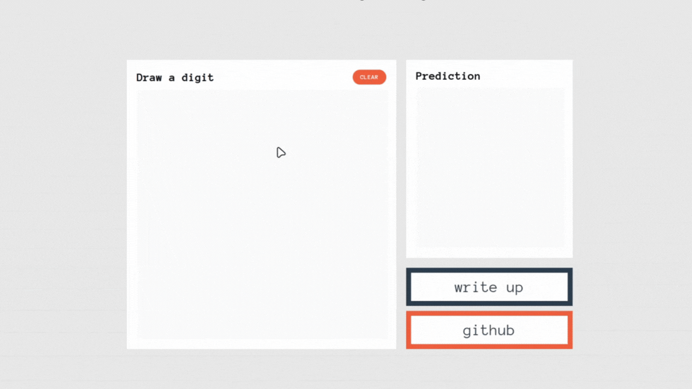

# Multilayer Perceptron for MNIST Classification

## Demonstration

<div align="center">
    
</div>

## Overview

This repository contains a project for my Linear Algebra college module (MA2283), where I built a Multilayer Perceptron (MLP) for handwritten digit classification using the MNIST dataset. The project combines theoretical mathematical derivations with a practical web-based demonstration. The MLP is implemented in TensorFlow/Keras, and a Flask-based web application allows users to draw digits and view prediction results in real time.

## Project Components

- **Model Training (`train_model.py`):**  
  Trains an MLP on the MNIST dataset. It normalizes image data, one-hot encodes labels, and builds a network with two hidden layers. The trained model is saved as `mnist_mlp.h5`.

- **Web Application (`app.py`):**  
  A Flask app that serves an interactive web page. Users can draw a digit on an HTML canvas, which is preprocessed and sent to the trained model for prediction. The prediction probabilities are then displayed on the interface.

- **Front-End (`script.js` & `style.css`):**

  - `script.js`: Manages the drawing canvas, handles user input, downscales the drawn digit to a 28×28 array, and sends the data to the backend for prediction.
  - `style.css`: Provides styling for the user interface.

- **Project Write-Up (`writeup.tex`):**  
  A comprehensive LaTeX document that details the mathematical derivation of the perceptron and multilayer perceptron, covering key concepts such as vector operations, activation functions, error backpropagation, and optimization techniques. This write-up bridges theory with practical implementation.

- **Dependencies (`requirements.txt`):**  
  Lists required libraries including Flask, TensorFlow, and NumPy.

## Installation

1. **Clone the repository:**

   ```bash
   git clone https://github.com/RobertDavidson1/MNIST_MultiLayerPerceptron.git
   cd MNIST_MultiLayerPerceptron
   ```

2. **Install Dependencies:**

   Ensure you have Python 3 installed. Then run:

   ```bash
   pip install -r requirements.txt
   ```

## Usage

### Training the Model

(Optional) Before running the web app, you could train the model on your own architecture, I've used a simple architecture for this demonstration

```bash
python train_model.py
```

This script downloads the MNIST dataset, trains the model, and saves it as `mnist_mlp.h5`.

### Running the Web Application

Once the model is trained, launch the Flask application:

```bash
python app.py
```

Then, open your browser and navigate to [http://localhost:5000](http://localhost:5000) to access the digit drawing interface. Draw a digit and view the model's predictions instantly.
